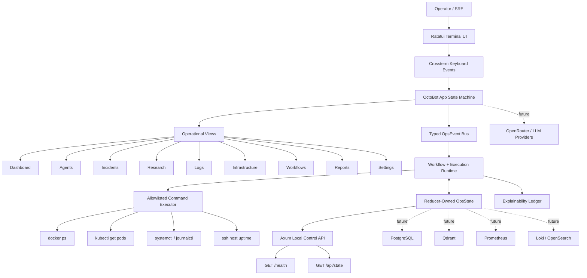
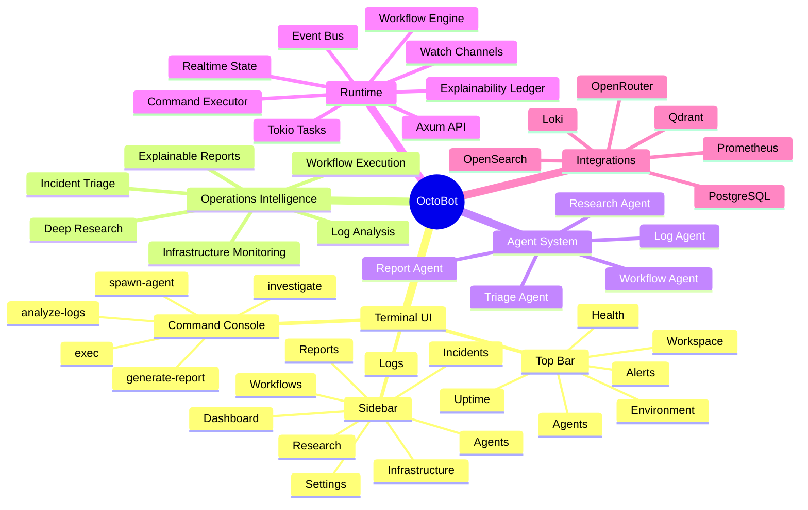
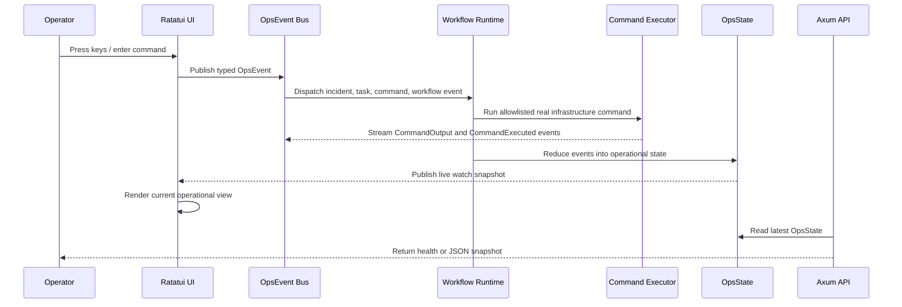

# OctoBot

OctoBot is a terminal-native AI operations control center built with Rust and Ratatui. It is designed as a keyboard-first infrastructure operations platform for monitoring systems, coordinating agents, investigating incidents, analyzing logs, tracking workflows, and producing explainable operational reports.

This is not a chatbot UI. The project is structured as a dense DevOps console inspired by tools such as k9s, lazygit, lazydocker, btop, and enterprise infrastructure dashboards.

## Current Status

The current implementation is a working Ratatui operations console with a Tier 1 execution core: controlled real infrastructure command execution, a typed async event bus, continuous real log streaming, a concrete incident workflow engine, and an explainability ledger. The Logs view starts `journalctl -f -n 0 --no-pager` at launch and only shows real stdout/stderr from allowlisted infrastructure commands. Some metric panels still use simulated values until Prometheus, Loki/OpenSearch, PostgreSQL, Qdrant, and OpenRouter are connected.

## Engineering Roadmap and Progress

The Tier 1 platform foundation is implemented in the current codebase. Progress bars below describe the current implementation, not the final product vision.

### Tier 1 - Must Have

Without these, the project weakens badly.

- [x] Real infrastructure execution - `[##########] 100%`
  Implemented with an allowlisted execution layer for real read-only commands: `docker ps`, `kubectl get pods`, `journalctl -n N --no-pager`, `systemctl --no-pager --failed`, `ps aux`, `df -h`, `uptime`, and `ssh <host> uptime`. Unsupported or unsafe commands are blocked.
- [x] Event-driven architecture - `[##########] 100%`
  Implemented with a typed `OpsEvent` bus, Tokio `mpsc` event ingestion, Tokio `watch` state snapshots, and a reducer-owned `OpsState`. Commands, agents, workflows, research, explainability, metrics, and execution output move as events.
- [x] Live streaming UI - `[##########] 100%`
  The TUI receives live state snapshots and continuously streams real `journalctl -f` stdout/stderr in the Logs view, plus execution status, metrics, workflow progress, agent tasks, and explainability records.
- [x] Workflow engine - `[##########] 100%`
  Implemented for the core incident flow: detect issue -> spawn/assign agents -> run real infrastructure evidence commands -> validate evidence -> generate report -> execute remediation through a dry-run approval gate.
- [x] Explainability layer - `[##########] 100%`
  Implemented with durable in-memory `ExplainabilityRecord` entries showing action, why it acted, evidence, confidence score, tools used, and timestamp.

Target event model:

```rust
enum Event {
    IncidentDetected,
    AgentSpawned,
    TaskAssigned,
    CommandRequested,
    CommandOutput,
    CommandExecuted,
    ResearchCompleted,
    WorkflowAdvanced,
    ExplainabilityRecorded,
}
```

The event-driven design is required to avoid request-response spaghetti and make the platform scalable.

### Tier 2 - High Impact

These make the project feel advanced and credible.

- [ ] Multi-agent coordination graph - `[##--------] 20%`
  Partially represented through the Agents view. A visual graph of Planner -> Research Agent / Infra Agent / Validator Agent is not implemented yet.
- [ ] Infrastructure time-travel analysis - `[----------] 0%`
  The system does not yet correlate deployments, logs, CPU, memory, commits, and incidents over time.
- [ ] Autonomous recovery workflows - `[----------] 0%`
  Restart service, clear temp files, rollback deployment, and rotate logs need safety controls before execution.
- [ ] RBAC - `[----------] 0%`
  Roles such as Admin, Operator, Read-only, and Security reviewer are still required.
- [ ] Incident replay mode - `[#---------] 10%`
  Early foundation only. Structured state and logs exist, but replay of alerts, metrics, logs, agent actions, and remediation steps is not implemented.

### Tier 3 - Elite Features

These are advanced differentiators.

- [ ] Sandbox command execution - `[########--] 80%`
  Implemented for local read-only execution with allowlists, blocked unsafe commands, streaming output, timeouts, SSH target validation, and dry-run approval gates. Still needs persisted policy management and per-role approvals.
- [ ] Research confidence engine - `[##--------] 20%`
  Partially represented by confidence scores. Evidence reliability, contradictions, and confidence ranking are not implemented yet.
- [ ] Plugin system - `[----------] 0%`
  Users cannot yet add tools, workflows, integrations, or agent types.
- [ ] Distributed agent execution - `[----------] 0%`
  Agents do not yet run across local processes, remote servers, containers, or clusters.
- [ ] Infrastructure knowledge graph - `[----------] 0%`
  Relationships between services, incidents, deployments, failures, and metrics still need to be modeled and persisted.

### Features Not Worth Prioritizing

Avoid spending engineering time on:

- Animated borders
- Theme obsession
- AI avatars
- Voice assistants
- Blockchain features
- AI marketplaces
- Social features
- Excessive settings
- 100 model providers
- Pretty landing pages

These do not improve the engineering value of the platform.

### Biggest Technical Improvements

The highest-value engineering improvements are:

1. Strong async runtime
   - Use Rust for concurrency, channels, streaming, and orchestration.
   - The advantage should come from systems design, not syntax alone.
2. Proper state management
   - Avoid spreading `Arc<Mutex<AppState>>` everywhere.
   - Prefer event-driven architecture, isolated state domains, and message passing.
3. Structured logs
   - Every action should generate structured events for replay, analytics, debugging, and observability.

```json
{
  "agent": "research",
  "task": "deployment_analysis",
  "status": "running",
  "timestamp": "..."
}
```

4. Fault tolerance
   - Agents will fail.
   - Handle retries, timeouts, fallback models, and partial failures.

### Most Important Improvement

Build one insanely polished workflow instead of 50 unfinished features.

Killer demo flow:

```txt
Server issue detected
  -> Agents investigate collaboratively
  -> Logs and metrics are correlated
  -> Root cause is identified
  -> Fix is suggested
  -> Service is restored
  -> Operational report is generated
```

If this one flow feels real, the project becomes memorable.

## Features

- Terminal-native Ratatui interface
- Keyboard-first navigation with vim-style movement
- Top operational status bar with workspace, environment, active agents, health, alerts, and uptime
- Left navigation sidebar for all major operational views
- Dashboard with SLO, throughput, evidence coverage, workflows, and infrastructure panels
- Agent orchestration view with role, status, task, and confidence score
- Incident investigation table with severity, service, status, and active hypothesis
- Research tree view for evidence-driven operational research
- Real log stream view backed only by stdout/stderr from allowlisted infrastructure commands
- Continuous default real log stream from `journalctl -f -n 0 --no-pager`
- Infrastructure health table with resource, kind, health, CPU, and memory
- Real infrastructure execution table with command status, exit code, and output preview
- Workflow monitor with owner, stage, and progress
- Explainable reports queue
- Settings view for OpenRouter, PostgreSQL, Qdrant, Prometheus, and Loki/OpenSearch integration boundaries
- Bottom command console for operational commands
- Typed async event bus with Tokio `mpsc` and realtime state snapshots through Tokio `watch`
- Workflow engine for the core detect -> investigate -> validate -> report -> approval flow
- Dry-run remediation approval gate for proposed write actions
- Explainability ledger for actions, evidence, confidence, and tools used
- Allowlisted command sandbox for safe read-only infrastructure execution
- Local Axum HTTP API for health and state snapshots
- Tiered engineering roadmap with progress bars for must-have, high-impact, and elite features

## Tech Stack

- Rust
- Ratatui
- Crossterm
- Tokio
- Axum
- Serde
- Reqwest
- Tracing

Planned integration targets:

- OpenRouter for LLM-backed agents
- PostgreSQL for incident timelines and workflow state
- Qdrant for operational memory and runbook retrieval
- Prometheus for metrics
- Loki or OpenSearch for logs
- WebSockets for realtime remote clients

## Run

```bash
cargo run
```

The TUI starts in the terminal. A local control API is also started on:

```txt
http://127.0.0.1:7878
```

Available endpoints:

```txt
GET /health
GET /api/state
```

## Controls

```txt
q          Quit
j / Down   Move navigation down
k / Up     Move navigation up
Tab        Switch to next view
Shift-Tab  Switch to previous view
1-9        Switch views directly
:          Enter command mode
Esc        Exit command mode
Enter      Execute command
Tab        Autocomplete command while command mode is active
```

Default autocomplete commands:

```txt
:investigate nginx_latency
:spawn-agent research
:analyze-logs auth-service
:generate-report incident_042
:exec uptime
:exec df -h
:exec ps aux
:exec docker ps
:exec kubectl get pods
:exec systemctl --no-pager --failed
:exec journalctl -n 40 --no-pager
:exec journalctl -f -n 0 --no-pager
```

The `:exec` command is intentionally sandboxed. Only allowlisted read-only infrastructure commands are executed. OctoBot also starts a continuous `journalctl -f -n 0 --no-pager` stream automatically for the Logs view.

## Application Views

| View | Purpose |
| --- | --- |
| Dashboard | High-level operational health, workflow, and infrastructure summary |
| Agents | Multi-agent orchestration status and current tasks |
| Incidents | Active incident investigations and hypotheses |
| Research | Evidence tree for deep operational research |
| Logs | Live operational log stream |
| Infrastructure | Resource health, CPU, and memory overview |
| Workflows | Active workflow execution monitoring |
| Reports | Explainable operational report queue |
| Settings | Provider and platform integration boundaries |

## Architecture



## Feature Map



## Runtime Flow



## Development

Format, check, and test:

```bash
cargo fmt
cargo check
cargo test
```

## Project Direction

The Tier 1 foundation is complete. The next major steps are to connect production backends and harden the platform:

- Replace simulated metric panels with Prometheus queries
- Replace local command log samples with Loki/OpenSearch streams
- Persist the event log, execution records, incidents, and explainability ledger in PostgreSQL
- Persist and expand remediation approval gates for write actions such as restart, rollback, and cleanup
- Store runbooks, reports, and operational memory in Qdrant
- Add OpenRouter-backed agent execution
- Add WebSocket streaming for remote orchestration clients
