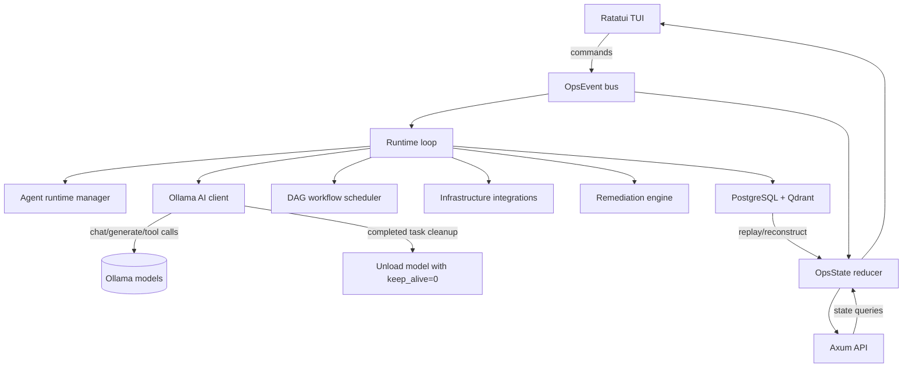

# OctoBot

OctoBot is a terminal-native AI operations control center built with Rust and Ratatui. It gives SRE, platform, DevOps, and security teams one keyboard-first console for incident investigation, AI agent orchestration, safe infrastructure command execution, workflow automation, operational memory, reporting, and audit replay.

Use OctoBot when you want to:

- Investigate incidents from a terminal without switching between dashboards, logs, commands, and notes.
- Delegate operational tasks to local AI agents backed by Ollama.
- Run allowlisted infrastructure checks with an event trail.
- Track recovery approvals, command output, explainability, and generated reports.
- Load YAML DAG workflows for repeatable incident or maintenance procedures.
- Persist event history and semantic memory with PostgreSQL and Qdrant when needed.

## Documentation

| Document | Use it for |
|----------|------------|
| [Quickstart Guide](docs/quickstart.md) | Install, run, and test the app quickly with working examples. |
| [User Guide](docs/user-guide.md) | Detailed command examples, feature walkthroughs, agent testing, and use-case recipes. |
| [Deployment Reference](docs/deployment.md) | Production-style setup, optional backends, environment variables, API, plugins, and troubleshooting. |

## Quick Start

```bash
cargo run
```

Press `/` for commands, **1-9** for views, **Tab** to cycle, **q** to quit.

## Commands

| Command | Description |
|---------|-------------|
| `/multi-agent <task>` | Delegate a task to planner/executor agents |
| `/spawn-agent research` | Register a dynamic AI agent |
| `/assign <agent> <task>` | Assign a task to an agent |
| `/tasks-report` | Generate a report of recent agent task events |
| `/investigate <name>` | Create an incident and start investigation |
| `/exec <command>` | Run an allowlisted infra command |
| `/analyze-logs <service>` | Request log analysis |
| `/generate-report <name>` | Export a JSON report |
| `/login ollama <url>` | Set Ollama endpoint at runtime |
| `/recover <service>` | Propose a recovery action |
| `/approve <id>` | Approve a recovery (requires Operator+) |
| `/role <role>` | Switch role (admin/operator/readonly/security) |
| `/research confidence` | Refresh research confidence profile |
| `/graph link <from> <rel> <to>` | Add knowledge graph edge |
| `/plugin add <name> <kind>` | Register a new plugin |
| `/plugin enable <name>` | Enable a registered plugin |
| `/plugin disable <name>` | Disable an enabled plugin |
| `/sandbox policy <role> <action>` | Update sandbox approval policy |
| `/runtime set <agent> <kind> <endpoint>` | Register a distributed runtime |
| `/replay start` / `/replay step` | Walk through recorded events |

Allowlisted `/exec` commands: `docker ps`, `kubectl get pods`, `journalctl`, `systemctl`, `ps aux`, `df -h`, `uptime`, `ssh <host> <command>`.

## Views

| # | View | Purpose |
|---|------|---------|
| 1 | Dashboard | System health, agent throughput, event stream, infra health, workflow progress |
| 2 | Agents | Multi-agent orchestration, coordination graph, distributed runtime |
| 3 | Incidents | Active investigations and hypotheses |
| 4 | Research | Evidence tree, knowledge graph, explainability records |
| 5 | Logs | Live `journalctl -f` stream |
| 6 | Infrastructure | Resource health, execution records, time-travel timeline |
| 7 | Workflows | DAG workflow execution, autonomous recovery queue |
| 8 | Reports | Operational report queue, explainability ledger |
| 9 | Settings | Providers, plugin registry, sandbox policy, distributed runtimes |

## AI Runtime

Configure at launch via env vars:

| Variable | Default | Description |
|----------|---------|-------------|
| `OCTOBOT_OLLAMA_URL` | `http://localhost:11434` | Ollama endpoint URL |
| `OCTOBOT_OLLAMA_MODEL` | `llama3.1:8b` | Ollama model used by runtime login |
| `OCTOBOT_OLLAMA_RETRIES` | `2` | Ollama request retry count |

Or configure at runtime with `/login ollama <url>` — no restart needed.

## Persistence (optional)

| Variable | Default | Description |
|----------|---------|-------------|
| `OCTOBOT_DATABASE_URL` | — | PostgreSQL connection string |
| `OCTOBOT_QDRANT_URL` | — | Qdrant vector DB URL |
| `OCTOBOT_QDRANT_COLLECTION` | `octobot_operational_memory` | Qdrant collection name |
| `OCTOBOT_EMBEDDING_URL` | — | Embedding endpoint URL |

## Infrastructure Integrations (optional)

| Variable | Default | Description |
|----------|---------|-------------|
| `OCTOBOT_DOCKER_SOCKET` | `/var/run/docker.sock` | Docker socket path |
| `OCTOBOT_KUBERNETES_URL` | — | Kubernetes API URL |
| `OCTOBOT_PROMETHEUS_URL` | — | Prometheus URL |
| `OCTOBOT_LOKI_URL` | — | Loki URL |
| `OCTOBOT_OPENSEARCH_URL` | — | OpenSearch URL |

## Configuration

| Variable | Default | Description |
|----------|---------|-------------|
| `OCTOBOT_API_ADDR` | `127.0.0.1:7878` | Control API bind address |
| `OCTOBOT_WORKFLOW_DIR` | — | YAML DAG workflow directory |
| `OCTOBOT_PLUGIN_DIR` | — | Plugin manifest discovery directory |
| `OCTOBOT_LOG_LIMIT` | `120` | Max in-memory log lines |
| `OCTOBOT_EVENT_LIMIT` | `120` | Max in-memory events |
| `OCTOBOT_STREAM_CAPTURE_LINES` | `100` | Max captured output lines |
| `OCTOBOT_QDRANT_RETRY_ATTEMPTS` | `3` | Qdrant retry count |
| `OCTOBOT_AI_MAX_TURNS` | `5` | Max reasoning loop turns per AI task |
| `OCTOBOT_TRACE` | — | Enable tracing output |

## API

```
GET  /health
GET  /api/state
GET  /api/replay/events
GET  /api/replay/reconstruct
GET  /api/memory/search?q=<query>
GET  /api/incidents/similar?q=<query>
GET  /api/plugins
GET  /api/sessions
```

## Project Structure

```
├── Cargo.toml
├── migrations/              # SQLx migrations
├── reports/                 # Generated JSON reports
└── src/
    ├── main.rs              # Bootstrap and task wiring
    ├── api.rs               # Axum control API
    ├── ui.rs                # Ratatui rendering and input
    ├── models.rs            # State, events, agents, workflows, incidents
    ├── utils.rs             # IDs, timestamps, formatting
    ├── constants.rs         # Navigation items and command suggestions
    ├── reports.rs           # JSON report generation
    ├── tests.rs             # Unit tests (27)
    │
    ├── agents/              # Agent registry, runtime manager, memory
    │   └── mod.rs
    ├── ai/                  # Ollama client, model health, streaming, tool calls
    │   └── mod.rs
    ├── infra/               # Docker, K8s, Prometheus, Loki, OpenSearch, PG
    │   └── mod.rs
    ├── runtime/             # Event loop, command execution, AI tasks
    │   └── mod.rs
    ├── workflows/           # DAG runtime, YAML parser, scheduler
    │   └── mod.rs
    ├── observability/       # AI log analysis, anomaly detection, RCA
    │   └── mod.rs
    ├── persistence/         # PostgreSQL, Qdrant, replay
    │   └── mod.rs
    ├── remediation/         # Remediation engine, policy evaluation
    │   └── mod.rs
    ├── trace/               # Execution spans, replay sessions
    │   └── mod.rs
    └── plugins/             # Plugin trait, registry, lifecycle
        ├── mod.rs
        ├── host.rs
        └── registry.rs
```

## Architecture



## Controls

| Key | Action |
|-----|--------|
| `q` | Quit |
| `j`/`k` or `Up`/`Down` | Navigate views |
| `Tab` / `Shift-Tab` | Next / previous view |
| `1`-`9` | Switch view directly |
| `/` | Enter command mode |
| `?` or `h` | Toggle help overlay |
| `Esc` | Exit command / close help |
| `Enter` | Execute command |
| `Tab` (in command mode) | Autocomplete |

## Feature Implementation Status

### Phase 1 — Real AI Agent Runtime

- [x] **Agent registry** — dynamic `AgentRegistry` with register/get by name (`src/agents.rs`)
- [x] **Agent runtime manager** — `AgentRuntimeManager::handle_event()` processes spawn/task/lifecycle/memory events (`src/agents.rs`)
- [x] **Planner/Executor architecture** — `AgentRole::Planner` and `Executor` variants; planner agents decompose tasks via `create_subtask`/`finalize_plan` tools; executor agents run sub-tasks with full tool access (`src/runtime.rs:505‑680`)
- [x] **Agent lifecycle management** — `AgentSpawned`, `AgentLifecycleChanged`, `AgentTelemetryRecorded` events with state transitions (`src/agents.rs:90‑130`)
- [x] **Ollama AI runtime integration** — local Ollama client with model health checks, streaming, token usage tracking, runtime `/login`, and completed-task model unload (`src/ai.rs`)
- [x] **Tool-calling support** — `ToolSpec`/`ToolCall`/`AiResponse` types; OpenAI-compatible tool format; runs `exec_command` (allowlisted) and `complete_task` tools (`src/ai.rs:66‑300`)
- [x] **Structured tool execution** — `execute_ai_tool()` spawns real subprocesses via `tokio::process::Command`, captures stdout/stderr/exit_code (`src/runtime.rs:682‑783`)
- [x] **Agent memory** — `AgentMemory` with per-agent key-value store; `memory_context()` injects last 5 entries into AI system prompts; `AgentMemoryStored` events for persistence (`src/agents.rs:14‑55, 126‑136`)
- [x] **Inter-agent communication** — `AgentMessageRecorded` event; planner→executor `plan-execute` protocol in `handle_planner_task()` (`src/runtime.rs:630‑653`)
- [x] **Reasoning loops** — multi-turn AI loop up to `OCTOBOT_AI_MAX_TURNS` (default 5); feeds tool results back as history; breaks on `complete_task` or content-only response (`src/runtime.rs:321‑503`)
- [x] **Completed task status** — successful agent and planner tasks transition to `Completed` instead of falling back to `Idle` (`src/models.rs`, `src/runtime.rs`, `src/ui.rs`)
- [x] **Completed task model unload** — after a task reaches `Completed`, the Ollama model is unloaded with `keep_alive=0` to release local memory (`src/ai.rs`, `src/runtime.rs`)
- [x] **Retry/failure recovery** — 500ms sleep + retry on transient AI failures; marks agent `Failed` after max turns (`src/runtime.rs:448‑468`)
- [x] **Runtime telemetry** — `AgentTelemetryRecorded` on registration and task start; rendered as timeline events (`src/agents.rs:169‑174, 207‑212`)

### Phase 2 — Persistent Intelligence Layer

- [x] **PostgreSQL persistence** — `PostgresStore` with `PgPool`, upserts events/incidents/workflows/explainability/agent state (`src/persistence.rs:133‑231`)
- [x] **SQLx migration system** — `sqlx::migrate!("./migrations")` auto-applies at startup; 6 tables: `ops_events`, `incidents`, `workflows`, `explainability_records`, `agent_state`, `semantic_memory` (`migrations/0001_persistent_intelligence.sql`)
- [x] **Append-only event store** — `INSERT INTO ops_events` with `BIGSERIAL PRIMARY KEY`; events never mutated (`src/persistence.rs:159`)
- [x] **Event replay engine** — `load_events()` → `SELECT event FROM ops_events ORDER BY id ASC`; deserializes full event history (`src/persistence.rs:220‑231`)
- [x] **Historical state reconstruction** — `reconstruct_state()` replays events into `OpsState::empty()`; called at startup for cross-session continuity (`src/persistence.rs:599‑605`)
- [x] **Qdrant vector search** — `QdrantClient` with auto-create collection (384-d vectors), upsert with retry, source-filtered search (`src/persistence.rs:264‑424`)
- [x] **Embedding pipeline** — `EmbeddingClient::embed()` POSTs text to endpoint, returns `Vec<f32>` (`src/persistence.rs:427‑466`)
- [x] **Semantic memory retrieval** — `SemanticMemory::search()` embeds query + searches Qdrant; API: `GET /api/memory/search?q=` (`src/persistence.rs:115‑120, 257‑261`)
- [x] **Incident similarity search** — source-filtered (`"incident"`) semantic search; API: `GET /api/incidents/similar?q=` (`src/persistence.rs:122‑130`)
- [x] **Operational memory indexing** — `memory_document()` indexes 7 event types (IncidentDetected, ExplainabilityRecorded, ResearchCompleted, CommandExecuted, InfrastructureSnapshotRecorded, WorkflowDefinitionLoaded, ToolCallCompleted) (`src/persistence.rs:502‑597`)

### Phase 3 — Real Infrastructure Integrations

- [x] **Docker API** — `discover_docker()` connects via Unix socket, queries `/containers/json`, returns container health (`src/infra.rs:250‑308`)
- [x] **Kubernetes API** — `discover_kubernetes()` queries `/api/v1/pods` with SA token auth, returns pod health (`src/infra.rs:310‑351`)
- [x] **Prometheus integration** — `discover_prometheus()` queries `/api/v1/query?query=up` (`src/infra.rs:353‑384`)
- [x] **Loki integration** — `query_loki()` for LogQL queries; `enrich_from_loki()` decorates nodes with log presence (`src/infra.rs:142‑152, 183‑206`)
- [x] **OpenSearch integration** — `query_opensearch()` for `_search` queries; `enrich_from_opensearch()` decorates nodes (`src/infra.rs:154‑172, 209‑231`)
- [x] **SSH runtime execution** — allowlisted `ssh <host> uptime` with host validation (`safe_ssh_target()`) (`src/runtime.rs:1270‑1280`)
- [x] **PostgreSQL monitoring** — `discover_postgres()` queries `pg_stat_activity` (active connections) and `pg_stat_database` (cache hit ratios); health = cache hit ratio (`src/infra.rs:386‑456`)
- [x] **Infrastructure discovery** — `InfraIntegrations::discover()` calls all configured integrations + enrichment; runs every 30s (`src/runtime.rs:51‑85, src/infra.rs:49‑67`)
- [x] **Topology mapping** — `build_topology()` infers container→pod, pod→service, service→database edges from node names (`src/infra.rs:72‑140`)
- [x] **Dependency graph generation** — topology edges emitted as `KnowledgeEdgeAdded` events on each infra tick; stored in `state.topology` (`src/runtime.rs:64‑77`)

### Phase 4 — Autonomous Workflow Engine

- [x] **Dynamic workflows** — no hardcoded workflows in seed state; all workflows loaded from YAML or created at runtime (`src/models.rs` seed)
- [x] **DAG workflow runtime** — `DagWorkflowRuntime` with node state tracking, topological ready-node resolution, progress computation (`src/workflows.rs:118‑292`)
- [x] **YAML workflow definitions** — `load_worksflows_from_dir()` reads `.yaml`/`.yml` from `OCTOBOT_WORKFLOW_DIR` (`src/workflows.rs:20‑42`)
- [x] **Workflow parser** — `from_yaml()` uses `serde_yaml` with validation (empty id, duplicate nodes, missing deps, cycle detection via topological sort) (`src/workflows.rs:145‑159, 294‑358`)
- [x] **Workflow scheduler** — `step_dag_workflows()` runs every 1s; dispatches Command/AgentTask/Approval/Condition nodes; tracks pending nodes by command ID (`src/runtime.rs:873‑1030`)
- [x] **Retry policies** — `RetryPolicy` with attempts + backoff; `can_retry()`/`retry_backoff_ms()` on workflow runtime; on `CommandExecuted` failure, if retry available → `reset_node()` + delayed retry; if exhausted → marks `Failed` + triggers rollback (`src/runtime.rs:171‑225`)
- [x] **Conditional branching** — `evaluate_condition()` supports `key=value`, `key!=value`, `key>N`, `key<N` against `OpsState` context; unmet conditions skip downstream nodes via `skip_downstream_nodes()` (`src/workflows.rs:305‑328, src/runtime.rs:1032‑1070`)
- [x] **Rollback support** — `mark_for_rollback()` re-enqueues rollback target node; when a Command node fails with no retries, the `rollback` target is marked pending for execution (`src/runtime.rs:210‑220`)
- [x] **Approval checkpoints** — `Approval` node kind emits `RecoveryProposed` with `AwaitingApproval`; requires `Admin`/`Operator` role to approve (`src/runtime.rs:927‑949`)
- [x] **Parallel execution** — `ready_nodes()` returns all unblocked nodes; scheduler dispatches all ready nodes in a single tick (`src/workflows.rs:171‑193`)

### Phase 5 — AI-Driven Observability

- [x] **AI log analysis** — sends recent 20 log lines to AI for pattern/anomaly detection; emits `ResearchCompleted` (`src/observability.rs:42‑83`)
- [x] **Anomaly detection** — z-score on rolling 30-point metric window; emits `ExplainabilityRecorded` when |z| > 2.0 (`src/observability.rs:86‑123`)
- [x] **Root-cause hypothesis engine** — AI generates hypotheses from incident data + infra health + knowledge edges + timeline; emits `ExplainabilityRecorded` + `ResearchCompleted` (`src/observability.rs:126‑185`)
- [x] **Evidence correlation** — links incidents sharing services; correlates knowledge edges to incident IDs/names (`src/observability.rs:188‑215`)
- [x] **Dependency impact analysis** — scans knowledge edges for connections to failed service; returns human-readable impact list (`src/observability.rs:218‑236`)
- [x] **Incident summarization** — AI generates structured summaries with related edges + timeline events (`src/observability.rs:239‑281`)
- [x] **Predictive alerting** — linear regression forecast on metrics; alerts when next-3 forecast crosses 85% threshold (`src/observability.rs:284‑314`)
- [x] **SLO burn-rate analysis** — computes availability from infra health, error budget remaining, burn rate per hour (`src/observability.rs:317‑333`)
- [x] **Semantic log search** — `semantic_log_query()` produces indexed query strings for the persistence layer (`src/observability.rs:336‑338`)
- [x] **Confidence scoring engine** — weighted score from evidence reliability (30%), coordination links (20%), knowledge edges (20%), health (15%), minus contradiction penalty (`src/observability.rs:341‑355`)

### Phase 6 — Autonomous Remediation

- [x] **Safe execution engine** — `RemediationEngine` with `evaluate()` wrapping `parse_allowlisted_command()` plus remediation-specific patterns (`src/remediation.rs:16‑113`)
- [x] **Policy validation** — full `SandboxPolicy` integration; checks `review_required_for` patterns; risk-level evaluation (`Low`/`Medium`/`High`) per command+target (`src/remediation.rs:115‑131`)
- [x] **RBAC enforcement** — `can_approve_recovery()` checks `Admin`/`Operator`; high-risk operations gate on role (`src/remediation.rs:49‑55`)
- [x] **Rollback checkpoints** — `kubectl rollout undo` and `systemctl restart` are tracked as high-risk remediation actions (`src/remediation.rs:285‑298`)
- [x] **Approval queues** — `RecoveryProposed` with `AwaitingApproval`; `RecoveryApproved` triggers `CommandRequested`; full explainability chain (`src/remediation.rs:62‑108`)
- [x] **Restart execution** — `systemctl restart <service>` via `RemediationDecision::Approved` with policy check (`src/remediation.rs:16‑108`)
- [x] **Deployment rollback execution** — `kubectl rollout undo deployment/<name>` recognized as high-risk remediation (`src/remediation.rs:285‑298`)
- [x] **Scaling execution** — `kubectl scale` recognized as medium-risk remediation (`src/remediation.rs:119‑131`)
- [x] **Recovery verification** — `execute_and_verify()` checks target node health (≥80) after action, emits `ExplainabilityRecorded` with pass/fail evidence (`src/remediation.rs:133‑205`)
- [x] **Self-healing workflows** — `create_self_healing_workflow()` generates diagnose→restart→verify→escalate DAG on `IncidentDetected` (`src/remediation.rs:208‑283`)

### Phase 7 — Replay & Explainability

- [x] **Persistent replay sessions** — `ReplaySession` struct with id/name/created_at; `ReplayManager::start_session()` persists to `replay_sessions` table (`src/trace.rs:140‑175`)
- [x] **Timeline playback engine** — `step_session()` with `EventFilter` (All/Type/Types); position tracking; speed control via `playback_speed_ms` (`src/trace.rs:179‑232`)
- [x] **Reasoning traces** — `ExplainabilityRecord` emitted on agent registration, task start, observability analysis, remediation decisions, and trace spans (`src/trace.rs:53‑121`)
- [x] **Evidence visualization** — `build_evidence_chain()` formats up to 20 latest records with confidence + evidence bullets (`src/trace.rs:234‑249`)
- [x] **Audit history system** — append-only `ops_events` table with full event log; `replay_events()` loads all for replay (`src/persistence.rs:220‑231`)
- [x] **Decision-chain reconstruction** — `reconstruct_decision_chain()` maps incident id to timeline events + explainability records (`src/trace.rs:251‑275`)
- [x] **Execution tracing** — `TraceEngine` with `start_span()`/`end_span()`; parent span propagation; `active_span_count()`/`active_span_summary()` (`src/trace.rs:37‑136`)

### Phase 8 — Advanced TUI Experience

- [x] **Split-pane layouts** — dynamic horizontal/vertical splits per view; dashboard has 4 metric cards + system metrics + event preview + workflow/infra (`src/ui.rs:158‑271`)
- [x] **Floating windows** — help overlay (`?`/`h`) rendered as centered popup over all content (`src/ui.rs:742‑782`)
- [x] **Command palette** — `/` command mode, `Tab` autocomplete, 30 commands, 16 command categories (`src/constants.rs:43‑74`)
- [x] **Fuzzy search** — prefix-match completion via `command_completion()` (`src/ui.rs:1202‑1211`)
- [x] **Keyboard shortcuts** — comprehensive keybindings with help overlay (`src/ui.rs:889‑909`)
- [x] **Live event stream** — `draw_event_preview()` shows last 5 OpsEvents with colored type tags (`src/ui.rs:233‑249`)
- [x] **System metrics** — `draw_system_metrics()` with per-node CPU/memory bars (`src/ui.rs:217‑231`)
- [x] **Resource health indicators** — `octopus_health()` unicode symbols (`●◉○◎`) per node; `health_color()` traffic-light coloring (`src/ui.rs:1228‑1241, 1274‑1280`)
- [x] **Live metrics graphs** — `render_bar()` renders unicode filled/empty bars for CPU/memory (`src/ui.rs:233‑241`)

### Phase 9 — Plugin & Extensibility

- [x] **Plugin trait system** — `Plugin` trait with `init()`/`start()`/`stop()`/`shutdown()`/`execute()` lifecycle hooks (`src/plugin_host.rs:12‑34`)
- [x] **Native plugins** — `NativePlugin` with in-memory data store and status tracking (`src/plugin_host.rs:92‑131`)
- [x] **External script plugins** — `ExternalScriptPlugin` wraps `.sh` scripts as subprocess plugins (`src/plugin_host.rs:46‑90`)
- [x] **Plugin lifecycle manager** — `PluginRegistry` with `register()`/`enable()`/`disable()`/`unregister()`; status transitions emit `PluginRegistered`/`PluginStatusChanged` events (`src/plugin_registry.rs:28‑103`)
- [x] **Plugin directory discovery** — `discover_plugins()` scans directory for JSON manifests; `load_plugin_from_dir()` pairs manifests with `.sh` scripts (`src/plugin_host.rs:145‑181`)
- [x] **Hot-reload support** — `hot_reload()` rescans plugin directory; `remove_stale_plugins()` cleans unregistered entries (`src/plugin_registry.rs:130‑168`)
- [x] **Plugin sandboxing** — `ExternalScriptPlugin` runs scripts as subprocesses with stdout/stderr isolation; errors propagated as `Result` (`src/plugin_host.rs:67‑88`)
- [x] **Plugin registry API** — `PluginApi::handle_command()` processes `plugin add|enable|disable|remove|list|reload` commands (`src/plugin_registry.rs:190‑259`)
- [x] **SDK documentation** — `manifest_doc()` returns JSON schema + status lifecycle documentation (`src/plugin_host.rs:193‑213`)

### Phase 10 — Advanced Security Hardening

- [ ] **Zero-trust runtime security** — per-agent permission isolation, capability-based access control, isolated execution contexts, sandbox boundaries, memory isolation, and command execution permission tiers.
- [ ] **Secure command execution** — strict command allowlists, dangerous shell-pattern denial, shell injection blocking, input sanitization, argument validation, execution timeouts, process resource limits, seccomp restrictions, and chroot/container isolation where available.
- [ ] **AI prompt injection protection** — detection and blocking for prompt injection, jailbreaks, recursive agent manipulation, tool hijacking, hidden instructions, memory poisoning, and malicious workflow definitions.
- [ ] **Prompt and tool policy layer** — prompt sanitization, instruction filtering, AI output validation, tool-call verification, and policy-based response filtering.
- [ ] **Plugin security system** — signed manifests, permission scopes, sandboxing, filesystem restrictions, network restrictions, execution quotas, integrity validation, and malicious plugin detection.
- [ ] **Authentication and authorization** — secure local authentication, RBAC permissions, session expiration, encrypted local credentials, audit logging, MFA-ready architecture, API token management, and secure admin approval flows.

### Phase 11 — Vulnerability Detection & Self-Protection

- [ ] **Built-in vulnerability scanner** — detect unsafe shell execution, insecure Rust patterns, exposed secrets, weak permissions, unsafe plugin behavior, dependency vulnerabilities, SQL injection, command injection, insecure deserialization, path traversal, unsafe async patterns, and race conditions.
- [ ] **Automatic security auditing** — periodic self-audits, configuration audits, dependency checks, workflow validation, plugin behavior audits, runtime permission audits, memory leak detection, and unsafe API exposure checks.
- [ ] **Threat detection engine** — detect abnormal agent behavior, suspicious workflows, privilege escalation attempts, repeated failed commands, prompt manipulation, infinite loops, suspicious plugin activity, and resource exhaustion attacks.
- [ ] **AI-powered security analysis** — use local `deepseek-r1:8b` for vulnerability reasoning, threat analysis, attack-path detection, recommendations, exploitability scoring, and root-cause analysis.

### Phase 12 — Runtime Stability & Reliability

- [ ] **Memory protection** — memory leak detection, automatic cleanup, model memory monitoring, stale workflow cleanup, resource lifecycle tracking, and runaway task prevention.
- [ ] **Fault tolerance** — crash recovery, workflow checkpointing, persistent recovery state, automatic restart handling, corrupted state protection, and safe rollback recovery.
- [ ] **Rate limiting and abuse prevention** — protect command execution, workflow creation, AI requests, agent loops, plugin execution, and memory use from flooding or exhaustion.
- [ ] **Secure logging** — tamper-resistant logs, sensitive data redaction, encrypted audit trails, structured security logs, and attack event timelines.

### Phase 13 — Advanced Observability & Security UI

- [ ] **Security dashboard** — active threats, suspicious activity, blocked attacks, runtime integrity, permission violations, and vulnerability alerts.
- [ ] **Live security panels** — AI reasoning trace, command execution audit, plugin security monitor, resource protection status, and runtime sandbox monitor.
- [ ] **Attack visualization** — threat timelines, vulnerability explorer, workflow risk analysis, and security event replay.

### Phase 14 — Security Tooling

- [ ] **Dependency vulnerability scanner** — inspect local dependency metadata and flag vulnerable packages for offline review.
- [ ] **Local port scanner** — inventory listening local services and identify risky exposed ports.
- [ ] **Configuration analyzer** — validate OctoBot, runtime, workflow, plugin, and infrastructure configuration for insecure settings.
- [ ] **Log anomaly detector** — identify suspicious patterns, repeated failures, and abnormal security events in local logs.
- [ ] **Plugin behavior analyzer** — inspect plugin manifests, scripts, permissions, and runtime behavior for unsafe actions.
- [ ] **Workflow validator** — detect unsafe workflow definitions, risky commands, cyclic dependencies, missing approvals, and rollback gaps.
- [ ] **Sandbox inspector** — report active runtime boundaries, execution policies, filesystem access, network access, and resource limits.

### Phase 15 — Local AI Security Runtime

- [ ] **Local-only Ollama runtime** — enforce offline local inference through `http://localhost:11434` with no cloud APIs or external AI providers.
- [ ] **Dedicated local agent models** — coding agent `qwen2.5-coder:7b`, planning agent `llama3.1:8b`, security reasoning agent `deepseek-r1:8b`, and fast utility agent `phi4`.
- [ ] **Dynamic model switching** — route agent tasks to the correct local model with streaming responses and model health validation.
- [ ] **Offline capability guarantees** — keep all planning, coding, security reasoning, utility tasks, embeddings, memory, and workflows functional without external network dependencies where configured locally.

### Phase 16 — Production-Grade Architecture

- [ ] **Modular security layer** — central policy enforcement for agents, commands, plugins, workflows, memory, persistence, API access, and event handling.
- [ ] **Hardened event bus** — validate event producers, event schemas, security-sensitive transitions, and replay integrity.
- [ ] **Secure workflow runtime** — enforce workflow risk scoring, approvals, command policy gates, rollback controls, and malicious definition detection.
- [ ] **Isolated plugin runtime** — enforce signed manifests, scoped permissions, filesystem/network boundaries, quotas, and integrity checks.
- [ ] **Encrypted persistence and memory** — protect audit logs, credentials, recovery state, vector memory, and sensitive operational context at rest.
- [ ] **Resilient async runtime** — lifecycle tracking, cancellation safety, task supervision, backpressure, loop prevention, and resource cleanup.
- [ ] **Defense-in-depth controls** — layered protections, self-healing security controls, autonomous threat response, and runtime integrity verification.

## Development

```bash
cargo fmt && cargo check && cargo test   # 27 tests
```
