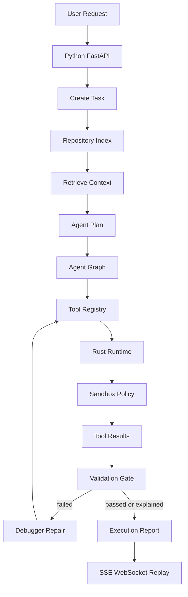
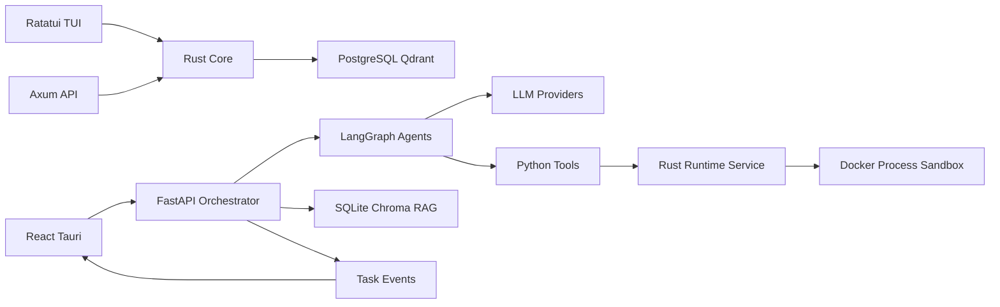

# OctoBot

OctoBot is a local-first AI operations and autonomous coding platform. It combines a Rust terminal control center, a secure runtime service, a Python orchestration layer, coding-agent tools, replayable events, plugin SDK tooling, and deployment profiles.

Use it to investigate incidents, run allowlisted infrastructure commands, coordinate agents, index repositories, execute coding workflows, review validation results, and generate reports with an audit trail.

## Documentation

| Document | Purpose |
|---|---|
| [Quickstart](docs/quickstart.md) | First local run |
| [User Guide](docs/user-guide.md) | Commands and workflows |
| [Deployment](docs/deployment.md) | Production setup |
| [Phase Notes](docs/phase-25-29-completion.md) | Latest phase completion |

## Status Legend

| Mark | Meaning |
|---|---|
| `[x]` | Complete |
| `[ ]` | Not complete |

## Phase Status

### Rust Operations Phases

| Phase | Status | Task |
|---|---:|---|
| 1 | [x] | AI agent runtime |
| 2 | [x] | Persistent intelligence layer |
| 3 | [x] | Infrastructure integration layer |
| 4 | [x] | Workflow engine runtime |
| 5 | [x] | AI observability engine |
| 6 | [x] | Autonomous remediation engine |
| 7 | [x] | Replay explainability layer |
| 8 | [x] | Advanced TUI experience |
| 9 | [x] | Plugin registry system |
| 10 | [x] | Security hardening layer |
| 11 | [x] | Vulnerability protection system |
| 12 | [x] | Runtime reliability guard |
| 13 | [x] | Security UI panels |
| 14 | [x] | Security tooling suite |
| 15 | [x] | Local AI security |
| 16 | [x] | Production architecture hardening |
| 17 | [x] | Agentic OS kernel |
| 18 | [x] | Conversation agent tab |

### Coding Platform Phases

| Phase | Status | Task |
|---|---:|---|
| 19 | [x] | Runtime service split |
| 20 | [x] | Python orchestration layer |
| 21 | [x] | Tree-sitter repository indexing |
| 22 | [x] | Coding memory RAG |
| 23 | [x] | LangGraph agent graph |
| 24 | [x] | Coding tool system |
| 25 | [x] | Execution repair loop |
| 26 | [x] | Full observability stack |
| 27 | [x] | Complete desktop UI |
| 28 | [x] | Signed plugin SDK |
| 29 | [x] | Production deployment mode |

### Phase Task Checklist

| Phase | Status | Task |
|---|---:|---|
| 21 | [x] | Repository walker cache |
| 21 | [x] | Stable file hashing |
| 21 | [x] | Symbol extraction pass |
| 21 | [x] | Dependency graph output |
| 21 | [x] | Tree-sitter parser support |
| 25 | [x] | Task creation API |
| 25 | [x] | Repository indexing pass |
| 25 | [x] | Context retrieval step |
| 25 | [x] | Plan generation step |
| 25 | [x] | Tool execution loop |
| 25 | [x] | Failure classification rules |
| 25 | [x] | Debugger repair pass |
| 25 | [x] | Validation gate record |
| 25 | [x] | Execution report output |
| 25 | [x] | Provider editing loop |
| 26 | [x] | Task SSE stream |
| 26 | [x] | Task WebSocket stream |
| 26 | [x] | Event replay API |
| 26 | [x] | Observability API |
| 26 | [x] | OpenTelemetry trace export |
| 26 | [x] | Prometheus metrics export |
| 26 | [x] | Correlation log records |
| 27 | [x] | React app surface |
| 27 | [x] | Tauri desktop shell |
| 27 | [x] | Task history panel |
| 27 | [x] | Event monitor panel |
| 27 | [x] | Diff viewer panel |
| 27 | [x] | Approval flow UI |
| 27 | [x] | Memory search UI |
| 28 | [x] | Manifest schema validation |
| 28 | [x] | Permission scope model |
| 28 | [x] | Plugin generation command |
| 28 | [x] | SDK test coverage |
| 28 | [x] | Signed manifest verification |
| 28 | [x] | Version locking policy |
| 28 | [x] | Plugin example packages |
| 29 | [x] | Service boundary map |
| 29 | [x] | Compose deployment profiles |
| 29 | [x] | Service Dockerfiles added |
| 29 | [x] | Worker scaling knobs |
| 29 | [x] | Service authentication |
| 29 | [x] | TLS endpoint configuration |
| 29 | [x] | Production healthchecks |

## Workflow



## Architecture



## Functions

| Function | Status | Main Files |
|---|---:|---|
| Terminal dashboard | [x] | `src/ui.rs` |
| Local API | [x] | `src/api.rs` |
| Event reducer | [x] | `src/models.rs` |
| Runtime loop | [x] | `src/runtime/mod.rs` |
| Runtime service | [x] | `src/runtime_service.rs` |
| Agent registry | [x] | `src/agents/mod.rs` |
| Ollama runtime | [x] | `src/ai/mod.rs` |
| Workflow DAGs | [x] | `src/workflows/mod.rs` |
| Remediation engine | [x] | `src/remediation/mod.rs` |
| Security policy | [x] | `src/security/mod.rs` |
| Persistence layer | [x] | `src/persistence/mod.rs` |
| Python orchestrator | [x] | `backend/octobot_orchestrator/main.py` |
| Agent graph | [x] | `backend/octobot_orchestrator/agents/graph.py` |
| Tool registry | [x] | `backend/octobot_orchestrator/tools/registry.py` |
| Repository indexer | [x] | `backend/octobot_orchestrator/indexer/repository.py` |
| Coding memory | [x] | `backend/octobot_orchestrator/memory/store.py` |
| Plugin SDK | [x] | `backend/octobot_orchestrator/plugins/sdk.py` |
| Desktop frontend | [x] | `frontend/` |

## Tech Stack

| Layer | Technology |
|---|---|
| Terminal UI | Rust, Ratatui, Crossterm |
| Rust API | Axum, Tokio |
| Runtime service | Rust WebSocket service |
| Python API | FastAPI, Pydantic |
| Agent graph | LangGraph with fallback planner |
| Frontend | React, TypeScript, Vite, Tauri |
| Persistence | PostgreSQL, SQLite |
| Vector memory | Qdrant, ChromaDB |
| Embeddings | HTTP endpoint, sentence-transformers, deterministic fallback |
| Runtime isolation | Docker, command policy, workspace policy |
| Git tooling | GitPython, runtime git commands |
| Testing | cargo test, pytest, ruff |

## LLM Providers

| Provider | Status | Usage | Configuration |
|---|---:|---|---|
| Ollama | [x] | Local Rust and Python agents | `OCTOBOT_OLLAMA_URL`, `OCTOBOT_OLLAMA_MODEL` |
| OpenAI | [x] | Python provider-backed agents | `OPENAI_API_KEY`, `OCTOBOT_OPENAI_MODEL` |
| Anthropic | [x] | Python provider-backed agents | `ANTHROPIC_API_KEY`, `OCTOBOT_ANTHROPIC_MODEL` |
| Groq | [x] | OpenAI-compatible provider | `OCTOBOT_GROQ_API_KEY` |

Default local model profiles:

| Role | Model |
|---|---|
| Planning | `llama3.1:8b` |
| Coding | `qwen2.5-coder:7b` |
| Security | `deepseek-r1:8b` |
| Utility | `phi4` |

## Codebase Structure

| Path | Purpose |
|---|---|
| `src/` | Rust TUI, API, runtime, security, workflows |
| `src/runtime_service.rs` | Standalone Rust tool runtime |
| `backend/` | Python autonomous orchestrator |
| `frontend/` | React and Tauri desktop app |
| `config/` | Environment and service configuration |
| `docker/` | Service Dockerfiles |
| `docker-compose.yml` | Dev and deployment profiles |
| `docs/` | Guides and phase notes |
| `migrations/` | SQLx database migrations |
| `tests/` | Python tests |
| `reports/` | Generated JSON reports |

## Commands

| Command | Purpose |
|---|---|
| `/multi-agent <task>` | Run agent task |
| `/spawn-agent research` | Add agent |
| `/assign <agent> <task>` | Assign task |
| `/investigate <name>` | Create incident |
| `/exec <command>` | Run safe command |
| `/recover <service>` | Propose recovery |
| `/approve <id>` | Approve recovery |
| `/generate-report <topic>` | Create report |
| `/replay start` | Start replay |
| `/replay step` | Step replay |
| `/plugin add <name> <kind>` | Add plugin |
| `/runtime smoke` | Test runtime |
| `/chat <message>` | Ask agent |

## Views

| Key | View | Purpose |
|---|---|---|
| `0` | Chat | Conversation agent |
| `1` | Dashboard | System summary |
| `2` | Agents | Agent state |
| `3` | Incidents | Incident tracking |
| `4` | Research | Evidence graph |
| `5` | Logs | Journal stream |
| `6` | Infrastructure | Node health |
| `7` | Workflows | DAG progress |
| `8` | Reports | Report queue |
| `9` | Settings | Security settings |

## Quick Start

```bash
cargo run
```

Python orchestrator:

```bash
. .venv/bin/activate
uvicorn backend.octobot_orchestrator.main:app --host 127.0.0.1 --port 8787
```

Runtime service:

```bash
OCTOBOT_RUNTIME_ONLY=1 cargo run
```

Frontend app:

```bash
cd frontend
npm ci
npm run dev
```

## Production Readiness

| Area | Status | Verification |
|---|---:|---|
| Rust build | [x] | `cargo check` |
| Rust tests | [x] | `cargo test` |
| Rust lint | [x] | `cargo clippy --all-targets -- -D warnings` |
| Python tests | [x] | `PYTHONPATH=. .venv/bin/pytest` |
| Python lint | [x] | `PYTHONPATH=. .venv/bin/ruff check backend tests` |
| Frontend build | [x] | `npm ci && npm run build` |
| Frontend audit | [x] | `npm audit` |
| Tauri shell | [x] | `cargo check` in `frontend/src-tauri` |
| Compose config | [x] | `docker compose --profile single-node config` |

Production deployment requires these secrets and paths:

| Variable | Purpose |
|---|---|
| `OCTOBOT_SERVICE_TOKEN` | Service-to-service API token |
| `OCTOBOT_TLS_CERT` | TLS certificate path |
| `OCTOBOT_TLS_KEY` | TLS private key path |
| `POSTGRES_PASSWORD` | PostgreSQL password |

## Verification

```bash
cargo test
cargo clippy --all-targets -- -D warnings
PYTHONPATH=. .venv/bin/pytest
PYTHONPATH=. .venv/bin/ruff check backend tests
```
