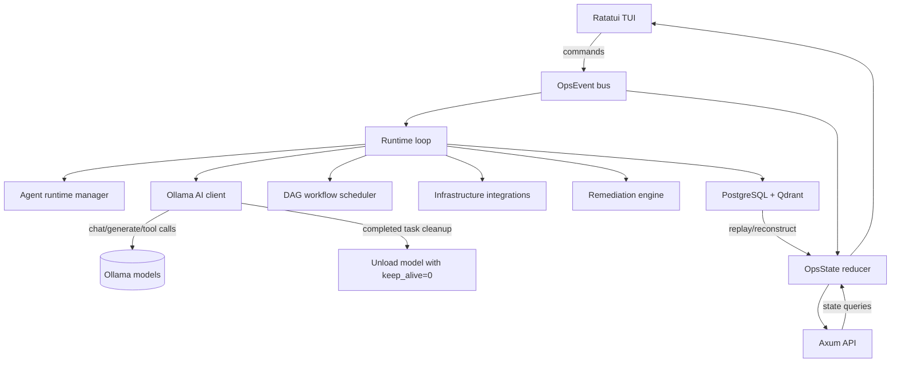

# OctoBot

OctoBot is a terminal-native AI operations control center built with Rust and Ratatui. It gives SRE, platform, DevOps, and security teams one keyboard-first console for incident investigation, AI agent orchestration, safe infrastructure command execution, workflow automation, operational memory, reporting, and audit replay.

Use OctoBot when you want to:

- Investigate incidents from a terminal without switching between dashboards, logs, commands, and notes.
- Delegate operational tasks to local AI agents backed by Ollama.
- Run allowlisted infrastructure checks with an event trail.
- Track recovery approvals, command output, explainability, and generated reports.
- Load YAML DAG workflows for repeatable incident or maintenance procedures.
- Persist event history and semantic memory with PostgreSQL and Qdrant when needed.

## Documentation

| Document | Use it for |
|----------|------------|
| [Quickstart Guide](docs/quickstart.md) | Install, run, and test the app quickly with working examples. |
| [User Guide](docs/user-guide.md) | Detailed command examples, feature walkthroughs, agent testing, and use-case recipes. |
| [Deployment Reference](docs/deployment.md) | Production-style setup, optional backends, environment variables, API, plugins, and troubleshooting. |

## Quick Start

```bash
cargo run
```

Press `/` for commands, **1-9** for views, **0** for Chat, **Tab** to cycle, **q** to quit.

## Commands

| Command | Description |
|---------|-------------|
| `/multi-agent <task>` | Delegate a task to planner/executor agents |
| `/spawn-agent research` | Register a dynamic AI agent |
| `/assign <agent> <task>` | Assign a task to an agent |
| `/tasks-report` | Generate a report of recent agent task events |
| `/investigate <name>` | Create an incident and start investigation |
| `/exec <command>` | Run an allowlisted infra command |
| `/analyze-logs <service>` | Request log analysis |
| `/generate-report <name>` | Export a JSON report |
| `/login ollama <url>` | Set Ollama endpoint at runtime |
| `/recover <service>` | Propose a recovery action |
| `/approve <id>` | Approve a recovery (requires Operator+) |
| `/role <role>` | Switch role (admin/operator/readonly/security) |
| `/research confidence` | Refresh research confidence profile |
| `/graph link <from> <rel> <to>` | Add knowledge graph edge |
| `/plugin add <name> <kind>` | Register a new plugin |
| `/plugin enable <name>` | Enable a registered plugin |
| `/plugin disable <name>` | Disable an enabled plugin |
| `/sandbox policy <role> <action>` | Update sandbox approval policy |
| `/runtime set <agent> <kind> <endpoint>` | Register a distributed runtime |
| `/replay start` / `/replay step` | Walk through recorded events |

Allowlisted `/exec` commands: `docker ps`, `kubectl get pods`, `journalctl`, `systemctl`, `ps aux`, `df -h`, `uptime`, `ssh <host> <command>`.

## Views

| # | View | Purpose |
|---|------|---------|
| 1 | Dashboard | System health, agent throughput, event stream, infra health, workflow progress |
| 2 | Agents | Multi-agent orchestration, coordination graph, distributed runtime |
| 3 | Incidents | Active investigations and hypotheses |
| 4 | Research | Evidence tree, knowledge graph, explainability records |
| 5 | Logs | Live `journalctl -f` stream |
| 6 | Infrastructure | Resource health, execution records, time-travel timeline |
| 7 | Workflows | DAG workflow execution, autonomous recovery queue |
| 8 | Reports | Operational report queue, explainability ledger |
| 9 | Settings | Security dashboard, provider status, plugin monitor, sandbox policy, replay |

## AI Runtime

Configure at launch via env vars:

| Variable | Default | Description |
|----------|---------|-------------|
| `OCTOBOT_OLLAMA_URL` | `http://localhost:11434` | Ollama endpoint URL |
| `OCTOBOT_OLLAMA_MODEL` | `llama3.1:8b` | Ollama model used by runtime login |
| `OCTOBOT_CHAT_MODEL` | falls back to `OCTOBOT_OLLAMA_MODEL` | Ollama model used by the Chat tab agent |
| `OCTOBOT_OLLAMA_RETRIES` | `2` | Ollama request retry count |

Or configure at runtime with `/login ollama <url>` — no restart needed.

## Persistence (optional)

| Variable | Default | Description |
|----------|---------|-------------|
| `OCTOBOT_DATABASE_URL` | — | PostgreSQL connection string |
| `OCTOBOT_QDRANT_URL` | — | Qdrant vector DB URL |
| `OCTOBOT_QDRANT_COLLECTION` | `octobot_operational_memory` | Qdrant collection name |
| `OCTOBOT_EMBEDDING_URL` | — | Embedding endpoint URL |

## Infrastructure Integrations (optional)

| Variable | Default | Description |
|----------|---------|-------------|
| `OCTOBOT_DOCKER_SOCKET` | `/var/run/docker.sock` | Docker socket path |
| `OCTOBOT_KUBERNETES_URL` | — | Kubernetes API URL |
| `OCTOBOT_PROMETHEUS_URL` | — | Prometheus URL |
| `OCTOBOT_LOKI_URL` | — | Loki URL |
| `OCTOBOT_OPENSEARCH_URL` | — | OpenSearch URL |

## Configuration

| Variable | Default | Description |
|----------|---------|-------------|
| `OCTOBOT_API_ADDR` | `127.0.0.1:7878` | Control API bind address |
| `OCTOBOT_WORKFLOW_DIR` | — | YAML DAG workflow directory |
| `OCTOBOT_PLUGIN_DIR` | — | Plugin manifest discovery directory |
| `OCTOBOT_LOG_LIMIT` | `120` | Max in-memory log lines |
| `OCTOBOT_EVENT_LIMIT` | `120` | Max in-memory events |
| `OCTOBOT_STREAM_CAPTURE_LINES` | `100` | Max captured output lines |
| `OCTOBOT_QDRANT_RETRY_ATTEMPTS` | `3` | Qdrant retry count |
| `OCTOBOT_AI_MAX_TURNS` | `5` | Max reasoning loop turns per AI task |
| `OCTOBOT_TRACE` | — | Enable tracing output |

## API

```
GET  /health
GET  /api/state
GET  /api/replay/events
GET  /api/replay/reconstruct
GET  /api/memory/search?q=<query>
GET  /api/incidents/similar?q=<query>
GET  /api/plugins
GET  /api/processes
GET  /api/syscalls
GET  /api/policy
GET  /api/apps
GET  /api/sessions
GET  /api/conversation
GET  /api/services
GET  /api/workspace
GET  /api/kernel/tasks
GET  /api/quotas
GET  /api/ipc
GET  /api/grants
GET  /api/packages
GET  /api/supervisor
GET  /api/boot
POST /api/agents/spawn/{role}
POST /api/processes/{agent}/kill
POST /api/processes/{agent}/pause
POST /api/processes/{agent}/resume
```

## Project Structure

```
├── Cargo.toml
├── migrations/              # SQLx migrations
├── reports/                 # Generated JSON reports
└── src/
    ├── main.rs              # Bootstrap and task wiring
    ├── api.rs               # Axum control API
    ├── ui.rs                # Ratatui rendering and input
    ├── models.rs            # State, events, agents, workflows, incidents
    ├── utils.rs             # IDs, timestamps, formatting
    ├── constants.rs         # Navigation items and command suggestions
    ├── reports.rs           # JSON report generation
    ├── tests.rs             # Unit tests (27)
    │
    ├── agents/              # Agent registry, runtime manager, memory
    │   └── mod.rs
    ├── ai/                  # Ollama client, model health, streaming, tool calls
    │   └── mod.rs
    ├── infra/               # Docker, K8s, Prometheus, Loki, OpenSearch, PG
    │   └── mod.rs
    ├── runtime/             # Event loop, command execution, AI tasks
    │   └── mod.rs
    ├── workflows/           # DAG runtime, YAML parser, scheduler
    │   └── mod.rs
    ├── observability/       # AI log analysis, anomaly detection, RCA
    │   └── mod.rs
    ├── persistence/         # PostgreSQL, Qdrant, replay
    │   └── mod.rs
    ├── remediation/         # Remediation engine, policy evaluation
    │   └── mod.rs
    ├── trace/               # Execution spans, replay sessions
    │   └── mod.rs
    └── plugins/             # Plugin trait, registry, lifecycle
        ├── mod.rs
        ├── host.rs
        └── registry.rs
```

## Architecture



## Controls

| Key | Action |
|-----|--------|
| `q` | Quit |
| `j`/`k` or `Up`/`Down` | Navigate views |
| `Tab` / `Shift-Tab` | Next / previous view |
| `1`-`9` | Switch view directly |
| `/` | Enter command mode |
| `?` or `h` | Toggle help overlay |
| `Esc` | Exit command / close help |
| `Enter` | Execute command |
| `Tab` (in command mode) | Autocomplete |

## Feature Implementation Status

### Phase 1 — Real AI Agent Runtime

- [x] **Agent registry** — dynamic `AgentRegistry` with register/get by name (`src/agents.rs`)
- [x] **Agent runtime manager** — `AgentRuntimeManager::handle_event()` processes spawn/task/lifecycle/memory events (`src/agents.rs`)
- [x] **Planner/Executor architecture** — `AgentRole::Planner` and `Executor` variants; planner agents decompose tasks via `create_subtask`/`finalize_plan` tools; executor agents run sub-tasks with full tool access (`src/runtime/mod.rs:505‑680`)
- [x] **Agent lifecycle management** — `AgentSpawned`, `AgentLifecycleChanged`, `AgentTelemetryRecorded` events with state transitions (`src/agents.rs:90‑130`)
- [x] **Ollama AI runtime integration** — local Ollama client with model health checks, streaming, token usage tracking, runtime `/login`, and completed-task model unload (`src/ai/mod.rs`)
- [x] **Tool-calling support** — `ToolSpec`/`ToolCall`/`AiResponse` types; OpenAI-compatible tool format; runs `exec_command` (allowlisted) and `complete_task` tools (`src/ai/mod.rs:66‑300`)
- [x] **Structured tool execution** — `execute_ai_tool()` spawns real subprocesses via `tokio::process::Command`, captures stdout/stderr/exit_code (`src/runtime/mod.rs:682‑783`)
- [x] **Agent memory** — `AgentMemory` with per-agent key-value store; `memory_context()` injects last 5 entries into AI system prompts; `AgentMemoryStored` events for persistence (`src/agents.rs:14‑55, 126‑136`)
- [x] **Inter-agent communication** — `AgentMessageRecorded` event; planner→executor `plan-execute` protocol in `handle_planner_task()` (`src/runtime/mod.rs:630‑653`)
- [x] **Reasoning loops** — multi-turn AI loop up to `OCTOBOT_AI_MAX_TURNS` (default 5); feeds tool results back as history; breaks on `complete_task` or content-only response (`src/runtime/mod.rs:321‑503`)
- [x] **Completed task status** — successful agent and planner tasks transition to `Completed` instead of falling back to `Idle` (`src/models.rs`, `src/runtime/mod.rs`, `src/ui.rs`)
- [x] **Completed task model unload** — after a task reaches `Completed`, the Ollama model is unloaded with `keep_alive=0` to release local memory (`src/ai/mod.rs`, `src/runtime/mod.rs`)
- [x] **Retry/failure recovery** — 500ms sleep + retry on transient AI failures; marks agent `Failed` after max turns (`src/runtime/mod.rs:448‑468`)
- [x] **Runtime telemetry** — `AgentTelemetryRecorded` on registration and task start; rendered as timeline events (`src/agents.rs:169‑174, 207‑212`)

### Phase 2 — Persistent Intelligence Layer

- [x] **PostgreSQL persistence** — `PostgresStore` with `PgPool`, upserts events/incidents/workflows/explainability/agent state (`src/persistence/mod.rs:133‑231`)
- [x] **SQLx migration system** — `sqlx::migrate!("./migrations")` auto-applies at startup; 6 tables: `ops_events`, `incidents`, `workflows`, `explainability_records`, `agent_state`, `semantic_memory` (`migrations/0001_persistent_intelligence.sql`)
- [x] **Append-only event store** — `INSERT INTO ops_events` with `BIGSERIAL PRIMARY KEY`; events never mutated (`src/persistence/mod.rs:159`)
- [x] **Event replay engine** — `load_events()` → `SELECT event FROM ops_events ORDER BY id ASC`; deserializes full event history (`src/persistence/mod.rs:220‑231`)
- [x] **Historical state reconstruction** — `reconstruct_state()` replays events into `OpsState::empty()`; called at startup for cross-session continuity (`src/persistence/mod.rs:599‑605`)
- [x] **Qdrant vector search** — `QdrantClient` with auto-create collection (384-d vectors), upsert with retry, source-filtered search (`src/persistence/mod.rs:264‑424`)
- [x] **Embedding pipeline** — `EmbeddingClient::embed()` POSTs text to endpoint, returns `Vec<f32>` (`src/persistence/mod.rs:427‑466`)
- [x] **Semantic memory retrieval** — `SemanticMemory::search()` embeds query + searches Qdrant; API: `GET /api/memory/search?q=` (`src/persistence/mod.rs:115‑120, 257‑261`)
- [x] **Incident similarity search** — source-filtered (`"incident"`) semantic search; API: `GET /api/incidents/similar?q=` (`src/persistence/mod.rs:122‑130`)
- [x] **Operational memory indexing** — `memory_document()` indexes 7 event types (IncidentDetected, ExplainabilityRecorded, ResearchCompleted, CommandExecuted, InfrastructureSnapshotRecorded, WorkflowDefinitionLoaded, ToolCallCompleted) (`src/persistence/mod.rs:502‑597`)

### Phase 3 — Real Infrastructure Integrations

- [x] **Docker API** — `discover_docker()` connects via Unix socket, queries `/containers/json`, returns container health (`src/infra.rs:250‑308`)
- [x] **Kubernetes API** — `discover_kubernetes()` queries `/api/v1/pods` with SA token auth, returns pod health (`src/infra.rs:310‑351`)
- [x] **Prometheus integration** — `discover_prometheus()` queries `/api/v1/query?query=up` (`src/infra.rs:353‑384`)
- [x] **Loki integration** — `query_loki()` for LogQL queries; `enrich_from_loki()` decorates nodes with log presence (`src/infra.rs:142‑152, 183‑206`)
- [x] **OpenSearch integration** — `query_opensearch()` for `_search` queries; `enrich_from_opensearch()` decorates nodes (`src/infra.rs:154‑172, 209‑231`)
- [x] **SSH runtime execution** — allowlisted `ssh <host> uptime` with host validation (`safe_ssh_target()`) (`src/runtime/mod.rs:1270‑1280`)
- [x] **PostgreSQL monitoring** — `discover_postgres()` queries `pg_stat_activity` (active connections) and `pg_stat_database` (cache hit ratios); health = cache hit ratio (`src/infra.rs:386‑456`)
- [x] **Infrastructure discovery** — `InfraIntegrations::discover()` calls all configured integrations + enrichment; runs every 30s (`src/runtime/mod.rs:51‑85, src/infra.rs:49‑67`)
- [x] **Topology mapping** — `build_topology()` infers container→pod, pod→service, service→database edges from node names (`src/infra.rs:72‑140`)
- [x] **Dependency graph generation** — topology edges emitted as `KnowledgeEdgeAdded` events on each infra tick; stored in `state.topology` (`src/runtime/mod.rs:64‑77`)

### Phase 4 — Autonomous Workflow Engine

- [x] **Dynamic workflows** — no hardcoded workflows in seed state; all workflows loaded from YAML or created at runtime (`src/models.rs` seed)
- [x] **DAG workflow runtime** — `DagWorkflowRuntime` with node state tracking, topological ready-node resolution, progress computation (`src/workflows/mod.rs:118‑292`)
- [x] **YAML workflow definitions** — `load_worksflows_from_dir()` reads `.yaml`/`.yml` from `OCTOBOT_WORKFLOW_DIR` (`src/workflows/mod.rs:20‑42`)
- [x] **Workflow parser** — `from_yaml()` uses `serde_yaml` with validation (empty id, duplicate nodes, missing deps, cycle detection via topological sort) (`src/workflows/mod.rs:145‑159, 294‑358`)
- [x] **Workflow scheduler** — `step_dag_workflows()` runs every 1s; dispatches Command/AgentTask/Approval/Condition nodes; tracks pending nodes by command ID (`src/runtime/mod.rs:873‑1030`)
- [x] **Retry policies** — `RetryPolicy` with attempts + backoff; `can_retry()`/`retry_backoff_ms()` on workflow runtime; on `CommandExecuted` failure, if retry available → `reset_node()` + delayed retry; if exhausted → marks `Failed` + triggers rollback (`src/runtime/mod.rs:171‑225`)
- [x] **Conditional branching** — `evaluate_condition()` supports `key=value`, `key!=value`, `key>N`, `key<N` against `OpsState` context; unmet conditions skip downstream nodes via `skip_downstream_nodes()` (`src/workflows/mod.rs:305‑328, src/runtime/mod.rs:1032‑1070`)
- [x] **Rollback support** — `mark_for_rollback()` re-enqueues rollback target node; when a Command node fails with no retries, the `rollback` target is marked pending for execution (`src/runtime/mod.rs:210‑220`)
- [x] **Approval checkpoints** — `Approval` node kind emits `RecoveryProposed` with `AwaitingApproval`; requires `Admin`/`Operator` role to approve (`src/runtime/mod.rs:927‑949`)
- [x] **Parallel execution** — `ready_nodes()` returns all unblocked nodes; scheduler dispatches all ready nodes in a single tick (`src/workflows/mod.rs:171‑193`)

### Phase 5 — AI-Driven Observability

- [x] **AI log analysis** — sends recent 20 log lines to AI for pattern/anomaly detection; emits `ResearchCompleted` (`src/observability.rs:42‑83`)
- [x] **Anomaly detection** — z-score on rolling 30-point metric window; emits `ExplainabilityRecorded` when |z| > 2.0 (`src/observability.rs:86‑123`)
- [x] **Root-cause hypothesis engine** — AI generates hypotheses from incident data + infra health + knowledge edges + timeline; emits `ExplainabilityRecorded` + `ResearchCompleted` (`src/observability.rs:126‑185`)
- [x] **Evidence correlation** — links incidents sharing services; correlates knowledge edges to incident IDs/names (`src/observability.rs:188‑215`)
- [x] **Dependency impact analysis** — scans knowledge edges for connections to failed service; returns human-readable impact list (`src/observability.rs:218‑236`)
- [x] **Incident summarization** — AI generates structured summaries with related edges + timeline events (`src/observability.rs:239‑281`)
- [x] **Predictive alerting** — linear regression forecast on metrics; alerts when next-3 forecast crosses 85% threshold (`src/observability.rs:284‑314`)
- [x] **SLO burn-rate analysis** — computes availability from infra health, error budget remaining, burn rate per hour (`src/observability.rs:317‑333`)
- [x] **Semantic log search** — `semantic_log_query()` produces indexed query strings for the persistence layer (`src/observability.rs:336‑338`)
- [x] **Confidence scoring engine** — weighted score from evidence reliability (30%), coordination links (20%), knowledge edges (20%), health (15%), minus contradiction penalty (`src/observability.rs:341‑355`)

### Phase 6 — Autonomous Remediation

- [x] **Safe execution engine** — `RemediationEngine` with `evaluate()` wrapping `parse_allowlisted_command()` plus remediation-specific patterns (`src/remediation/mod.rs:16‑113`)
- [x] **Policy validation** — full `SandboxPolicy` integration; checks `review_required_for` patterns; risk-level evaluation (`Low`/`Medium`/`High`) per command+target (`src/remediation/mod.rs:115‑131`)
- [x] **RBAC enforcement** — `can_approve_recovery()` checks `Admin`/`Operator`; high-risk operations gate on role (`src/remediation/mod.rs:49‑55`)
- [x] **Rollback checkpoints** — `kubectl rollout undo` and `systemctl restart` are tracked as high-risk remediation actions (`src/remediation/mod.rs:285‑298`)
- [x] **Approval queues** — `RecoveryProposed` with `AwaitingApproval`; `RecoveryApproved` triggers `CommandRequested`; full explainability chain (`src/remediation/mod.rs:62‑108`)
- [x] **Restart execution** — `systemctl restart <service>` via `RemediationDecision::Approved` with policy check (`src/remediation/mod.rs:16‑108`)
- [x] **Deployment rollback execution** — `kubectl rollout undo deployment/<name>` recognized as high-risk remediation (`src/remediation/mod.rs:285‑298`)
- [x] **Scaling execution** — `kubectl scale` recognized as medium-risk remediation (`src/remediation/mod.rs:119‑131`)
- [x] **Recovery verification** — `execute_and_verify()` checks target node health (≥80) after action, emits `ExplainabilityRecorded` with pass/fail evidence (`src/remediation/mod.rs:133‑205`)
- [x] **Self-healing workflows** — `create_self_healing_workflow()` generates diagnose→restart→verify→escalate DAG on `IncidentDetected` (`src/remediation/mod.rs:208‑283`)

### Phase 7 — Replay & Explainability

- [x] **Persistent replay sessions** — `ReplaySession` struct with id/name/created_at; `ReplayManager::start_session()` persists to `replay_sessions` table (`src/trace.rs:140‑175`)
- [x] **Timeline playback engine** — `step_session()` with `EventFilter` (All/Type/Types); position tracking; speed control via `playback_speed_ms` (`src/trace.rs:179‑232`)
- [x] **Reasoning traces** — `ExplainabilityRecord` emitted on agent registration, task start, observability analysis, remediation decisions, and trace spans (`src/trace.rs:53‑121`)
- [x] **Evidence visualization** — `build_evidence_chain()` formats up to 20 latest records with confidence + evidence bullets (`src/trace.rs:234‑249`)
- [x] **Audit history system** — append-only `ops_events` table with full event log; `replay_events()` loads all for replay (`src/persistence/mod.rs:220‑231`)
- [x] **Decision-chain reconstruction** — `reconstruct_decision_chain()` maps incident id to timeline events + explainability records (`src/trace.rs:251‑275`)
- [x] **Execution tracing** — `TraceEngine` with `start_span()`/`end_span()`; parent span propagation; `active_span_count()`/`active_span_summary()` (`src/trace.rs:37‑136`)

### Phase 8 — Advanced TUI Experience

- [x] **Split-pane layouts** — dynamic horizontal/vertical splits per view; dashboard has 4 metric cards + system metrics + event preview + workflow/infra (`src/ui.rs:158‑271`)
- [x] **Floating windows** — help overlay (`?`/`h`) rendered as centered popup over all content (`src/ui.rs:742‑782`)
- [x] **Command palette** — `/` command mode, `Tab` autocomplete, 30 commands, 16 command categories (`src/constants.rs:43‑74`)
- [x] **Fuzzy search** — prefix-match completion via `command_completion()` (`src/ui.rs:1202‑1211`)
- [x] **Keyboard shortcuts** — comprehensive keybindings with help overlay (`src/ui.rs:889‑909`)
- [x] **Live event stream** — `draw_event_preview()` shows last 5 OpsEvents with colored type tags (`src/ui.rs:233‑249`)
- [x] **System metrics** — `draw_system_metrics()` with per-node CPU/memory bars (`src/ui.rs:217‑231`)
- [x] **Resource health indicators** — `octopus_health()` unicode symbols (`●◉○◎`) per node; `health_color()` traffic-light coloring (`src/ui.rs:1228‑1241, 1274‑1280`)
- [x] **Live metrics graphs** — `render_bar()` renders unicode filled/empty bars for CPU/memory (`src/ui.rs:233‑241`)

### Phase 9 — Plugin & Extensibility

- [x] **Plugin trait system** — `Plugin` trait with `init()`/`start()`/`stop()`/`shutdown()`/`execute()` lifecycle hooks (`src/plugin_host.rs:12‑34`)
- [x] **Native plugins** — `NativePlugin` with in-memory data store and status tracking (`src/plugin_host.rs:92‑131`)
- [x] **External script plugins** — `ExternalScriptPlugin` wraps `.sh` scripts as subprocess plugins (`src/plugin_host.rs:46‑90`)
- [x] **Plugin lifecycle manager** — `PluginRegistry` with `register()`/`enable()`/`disable()`/`unregister()`; status transitions emit `PluginRegistered`/`PluginStatusChanged` events (`src/plugin_registry.rs:28‑103`)
- [x] **Plugin directory discovery** — `discover_plugins()` scans directory for JSON manifests; `load_plugin_from_dir()` pairs manifests with `.sh` scripts (`src/plugin_host.rs:145‑181`)
- [x] **Hot-reload support** — `hot_reload()` rescans plugin directory; `remove_stale_plugins()` cleans unregistered entries (`src/plugin_registry.rs:130‑168`)
- [x] **Plugin sandboxing** — `ExternalScriptPlugin` runs scripts as subprocesses with stdout/stderr isolation; errors propagated as `Result` (`src/plugin_host.rs:67‑88`)
- [x] **Plugin registry API** — `PluginApi::handle_command()` processes `plugin add|enable|disable|remove|list|reload` commands (`src/plugin_registry.rs:190‑259`)
- [x] **SDK documentation** — `manifest_doc()` returns JSON schema + status lifecycle documentation (`src/plugin_host.rs:193‑213`)

### Phase 10 — Advanced Security Hardening

- [x] **Zero-trust runtime security** — `SecurityPolicy` enforces role/tool capability checks, read-only vs remediation command tiers, sandbox boundaries, rate-limited AI/command execution, and runtime cleanup (`src/security/mod.rs:94-229`, `src/runtime/mod.rs:60-61, 114-115, 1151`)
- [x] **Secure command execution** — command validation blocks shell metacharacters/control characters, caps arguments and journal line counts, restricts SSH targets, preserves execution timeouts, and redacts command output (`src/security/mod.rs:104-174`, `src/runtime/mod.rs:1517-1758`)
- [x] **AI prompt injection protection** — prompt-injection/jailbreak/tool-hijack indicators are detected before task dispatch and plugin/tool execution (`src/security/mod.rs:183-215`, `src/runtime/mod.rs:225-238`, `src/plugins/host.rs:83-90, 164-170`)
- [x] **Prompt and tool policy layer** — prompt sanitization, sensitive value filtering, per-role tool-call verification, and policy-based blocked responses are centralized in `SecurityPolicy` (`src/security/mod.rs:183-229`, `src/runtime/mod.rs:1151-1154`)
- [x] **Plugin security system** — plugin descriptors are validated, plugin manifests get hash-based integrity checks, kind-specific permission scopes are assigned, script paths are constrained, and plugin I/O is sanitized/redacted (`src/security/mod.rs:231-302`, `src/plugins/host.rs:64-96, 143-170, 203-224`, `src/plugins/registry.rs:38, 224`)
- [x] **Authentication and authorization** — `AuthManager` supports hashed local API/session tokens, role authorization, TTL expiration, admin/operator/read-only separation, and integrates with existing RBAC approval flows (`src/security/mod.rs:304-352`, `src/models.rs:98-108`, `src/remediation/mod.rs`)

### Phase 11 — Vulnerability Detection & Self-Protection

- [x] **Built-in vulnerability scanner** — `SecurityAuditor::scan_source()` detects unsafe shell execution, secret handling, path traversal hints, panic-prone sync patterns, unsafe command records, and unsafe plugin manifests (`src/security/mod.rs:355-423`)
- [x] **Automatic security auditing** — the runtime runs periodic security self-audits, records explainability findings, audits command/plugin/policy state, and feeds memory pressure into reliability cleanup (`src/runtime/mod.rs:103-115`, `src/security/mod.rs:355-454`)
- [x] **Threat detection engine** — `ThreatDetector` flags repeated failed commands, prompt manipulation, and resource-exhaustion patterns, then emits explainability threat events (`src/security/mod.rs:456-510`, `src/runtime/mod.rs:107-108`)
- [x] **AI-powered security analysis** — `SecurityAuditor::ai_security_prompt()` formats findings for local `deepseek-r1:8b` exploitability, attack-path, recommendation, and root-cause analysis (`src/security/mod.rs:425-431`, `src/ai/mod.rs:42-48`)

### Phase 12 — Runtime Stability & Reliability

- [x] **Memory protection** — `ReliabilityGuard` prunes stale agents/workflows, bounds reasoning/notification payloads, reports memory pressure, and combines with existing model unload and bounded state buffers (`src/security/mod.rs:512-539`, `src/runtime/mod.rs:114-123, 937-960`, `src/models.rs:1337-1372`)
- [x] **Fault tolerance** — startup state reconstruction, DAG checkpoint/progress events, retry/backoff, rollback node re-enqueue, and corrupted-state-safe replay remain active (`src/persistence/mod.rs:599-605`, `src/runtime/mod.rs:171-225, 873-1030`, `src/workflows/mod.rs:118-292`)
- [x] **Rate limiting and abuse prevention** — command execution and AI task dispatch use sliding-window `RateLimiter`; tool execution has timeouts; state limits guard event/log/execution floods (`src/security/mod.rs:62-92`, `src/runtime/mod.rs:60-61, 137-159, 211-223, 1217-1221`, `src/models.rs:1337-1372`)
- [x] **Secure logging** — sensitive command/plugin output is redacted, reducer logs sanitize streamed lines, and `SecureLogger` builds hash-chained tamper-evident audit records for attack timelines (`src/security/mod.rs:542-587`, `src/runtime/mod.rs:1197-1199, 1633-1634, 1731`, `src/models.rs:1039-1058`)

### Phase 13 — Advanced Observability & Security UI

- [x] **Security dashboard** — Settings view now renders active threats, suspicious activity, blocked attacks, runtime integrity, permission violations, and vulnerability alert cards from `SecurityUiSummary` (`src/ui.rs:894-976, 1852-1969`)
- [x] **Live security panels** — command execution audit, plugin security monitor, resource protection, runtime sandbox status, and AI reasoning trace panels are rendered in the security view (`src/ui.rs:978-1092, 1186-1232`)
- [x] **Attack visualization** — threat timeline, vulnerability explorer, workflow risk summary, and security event replay filter expose attack timelines and policy events (`src/ui.rs:1094-1232, 1971-1995`)

### Phase 14 — Security Tooling

- [x] **Dependency vulnerability scanner** — `SecurityTooling::scan_dependency_metadata()` inspects local dependency metadata and flags packages that require offline vulnerability review (`src/security/mod.rs:506-538`)
- [x] **Local port scanner** — `SecurityTooling::scan_proc_net_tcp()` inventories `/proc/net/tcp*` listening services and identifies risky local/admin ports (`src/security/mod.rs:540-570`)
- [x] **Configuration analyzer** — `SecurityTooling::analyze_configuration()` validates OctoBot service endpoints and active role posture for insecure settings (`src/security/mod.rs:572-614`)
- [x] **Log anomaly detector** — `SecurityTooling::detect_log_anomalies()` detects repeated failures, blocked actions, denials, and prompt manipulation in local logs (`src/security/mod.rs:616-649`)
- [x] **Plugin behavior analyzer** — `SecurityTooling::analyze_plugins()` inspects plugin manifests, descriptions, permissions, and credential-handling indicators (`src/security/mod.rs:651-677`)
- [x] **Workflow validator** — `SecurityTooling::validate_workflow_yaml()` detects unsafe workflow commands, malformed definitions, duplicate nodes, missing approvals, and rollback gaps (`src/security/mod.rs:679-752`)
- [x] **Sandbox inspector** — `SecurityTooling::inspect_sandbox()` reports sandbox persistence gaps and active non-local runtime boundaries (`src/security/mod.rs:774-807`)

### Phase 15 — Local AI Security Runtime

- [x] **Local-only Ollama runtime** — `AiClient` accepts only localhost/loopback Ollama endpoints, falls back to `http://localhost:11434`, and rejects non-local `/login ollama` endpoints (`src/ai/mod.rs:164-182, 333-340, 636-646`, `src/runtime/mod.rs:370-397`)
- [x] **Dedicated local agent models** — coding agent `qwen2.5-coder:7b`, planning agent `llama3.1:8b`, security reasoning agent `deepseek-r1:8b`, and fast utility agent `phi4` are declared as default profiles (`src/ai/mod.rs:36-83`)
- [x] **Dynamic model switching** — runtime routes roles to the correct local profile, streams Ollama responses, records model health, and unloads completed-task models (`src/ai/mod.rs:86-97, 341-379`, `src/runtime/mod.rs:424-462, 816-835`)
- [x] **Offline capability guarantees** — planning, coding, security reasoning, utility tasks, local model health, security tooling, memory, and workflows continue through local runtime paths without cloud AI providers (`src/ai/mod.rs:164-182`, `src/security/mod.rs:487-503`, `src/runtime/mod.rs:102-145`)

### Phase 16 — Production-Grade Architecture

- [x] **Modular security layer** — `SecurityPolicy::validate_event()` centralizes policy enforcement for commands, tools, plugins, workflows, AI provider login, persistence protection, and event handling (`src/security/mod.rs:220-242, 840-895`, `src/runtime/mod.rs:225-239`)
- [x] **Hardened event bus** — `EventBusSecurity` validates event schemas, rejects unsafe producers/transitions, and computes replay integrity hashes during observability cycles (`src/security/mod.rs:840-895`, `src/runtime/mod.rs:111-121, 225-239`)
- [x] **Secure workflow runtime** — workflow approvals now include risk scoring, command policy gates remain enforced, workflow validation detects malicious definitions, and rollback/approval gaps are reported (`src/security/mod.rs:679-752, 932-951`, `src/runtime/mod.rs:1488-1513`)
- [x] **Isolated plugin runtime** — plugin manifests use integrity checks, kind-scoped permissions, filesystem/network denials, input quotas, and runtime boundary enforcement before native or script execution (`src/security/mod.rs:271-337`, `src/plugins/host.rs:79-86, 158-168`)
- [x] **Encrypted persistence and memory** — `PersistenceProtector` protects sensitive persisted state values, command/tool memory text is redacted before vector indexing, and audit logs remain hash chained (`src/security/mod.rs:898-930`, `src/persistence/mod.rs:154-165, 547-600`)
- [x] **Resilient async runtime** — `AsyncRuntimeGuard` reports event/agent backpressure, runtime cleanup bounds state, AI/command rate limits supervise producers, and model unload/cancellation paths remain active (`src/security/mod.rs:954-994`, `src/runtime/mod.rs:111-121, 155-178`)
- [x] **Defense-in-depth controls** — layered prompt, command, tool, plugin, workflow, event, persistence, runtime, and threat-detection controls now emit explainability records for blocked transitions and self-audit findings (`src/security/mod.rs:94-337, 456-994`, `src/runtime/mod.rs:103-178, 225-239`)

### Phase 17 — Agentic OS Kernel

- [x] **Agent kernel scheduler** — central scheduler state tracks agent processes, queued/running kernel tasks, priorities, attempts, lifecycle transitions, and backpressure-visible task state (`src/models.rs`, `src/runtime/mod.rs`)
- [x] **Agent process table** — OS-style process model for agents with PID-like IDs, parent/child relationships, role, status, runtime, task, memory scope, resource usage, and lifecycle controls (`src/models.rs`, `src/ui.rs`, `src/api.rs`)
- [x] **Capability-based system calls** — standard syscall policy and audit layer for `fs.read`, `fs.write`, `shell.exec`, `memory.search`, `memory.write`, `workflow.start`, `plugin.call`, `network.request`, and `event.emit`, all mediated by role/capability policy (`src/security/mod.rs`, `src/models.rs`)
- [x] **Agentic shell commands** — OS-like command surface for `/ps`, `/kill <agent>`, `/pause <agent>`, `/resume <agent>`, `/apps`, `/run <app|workflow>`, `/syscalls`, `/policy show`, `/memory search`, and `/agent spawn` (`src/ui.rs`, `src/constants.rs`)
- [x] **Agent filesystem and workspace layer** — scoped virtual workspace records agent artifacts, scratchpads, report outputs, immutable flags, ownership, paths, sizes, and creation timestamps (`src/models.rs`, `src/ui.rs`, `src/api.rs`)
- [x] **System services model** — long-running internal services for scheduler, event bus, memory, policy, workflow runtime, plugin/app runtime, observability, security, and persistence are modeled and exposed (`src/models.rs`, `src/api.rs`)
- [x] **Agentic app runtime** — plugins are promoted into agentic apps with permissions, commands, status, install records, and shell/API visibility (`src/models.rs`, `src/ui.rs`, `src/api.rs`)
- [x] **Resource accounting and quotas** — per-agent quotas track tool calls, model tokens, memory writes, and event emission against configured limits (`src/models.rs`)
- [x] **Inter-agent IPC** — structured message passing between agents, apps, workflows, and services includes topics, payloads, delivery state, audit trails, and shell/API visibility (`src/models.rs`, `src/ui.rs`, `src/api.rs`)
- [x] **Policy and permissions manager** — interactive capability grants, role-aware approvals, temporary grants, policy display, syscall denial, and explainable policy records are represented in state and shell/API views (`src/security/mod.rs`, `src/models.rs`, `src/ui.rs`, `src/api.rs`)
- [x] **Agent memory manager** — scoped semantic/episodic/shared memory entries track retention-ready metadata, provenance, previews, and search through the agentic shell/API (`src/models.rs`, `src/ui.rs`, `src/api.rs`)
- [x] **App marketplace and package format** — local package records include signatures, dependencies, source, install state, version pinning, and offline import through the agentic shell (`src/models.rs`, `src/ui.rs`)
- [x] **System observability console** — OS-level process, service, syscall, event, model, memory, app, supervisor, boot, and policy views are exposed through shell reports and REST endpoints (`src/ui.rs`, `src/api.rs`)
- [x] **Crash recovery and supervision tree** — supervisor events isolate failed agents, preserve restart/isolation metadata, and expose recovery state through replayable state/API views (`src/models.rs`, `src/ui.rs`, `src/api.rs`)
- [x] **Boot sequence and init system** — boot profile, startup services, mounted workspaces, default policy, initialized time, and deterministic boot status are modeled and exposed (`src/models.rs`, `src/ui.rs`, `src/api.rs`)
- [x] **Agentic OS API** — REST/local API endpoints cover process management, syscalls, apps, policies, memory/workspace, workflows/events, services, boot, supervisor, and system health, including mutating process spawn/pause/resume/kill endpoints (`src/api.rs`, `src/main.rs`)
- [x] **Agentic OS identity** — README and project article position OctoBot as a local-first agentic OS for DevOps, SRE, and security operations while keeping OctoBot as the shell/control surface (`README.md`, `OctoBot.md`)

### Phase 18 — Conversational Project Agent

- [x] **Conversation AI tab/API** — terminal UI includes a dedicated Chat tab on `0`; `/chat` records user messages and agent responses there while preserving the existing 1-9 operational views (`src/constants.rs`, `src/ui.rs`)
- [x] **Natural-language chat command** — `/chat <request>` routes questions to the best-fit local agent role, records the user message, and writes the agent's final answer back into Chat (`src/ui.rs`, `src/runtime/mod.rs`, `src/models.rs`)
- [x] **Conversation state and API** — conversation messages are persisted in `OpsState`, flow through the event bus, appear in timeline/replay tags, and are exposed at `GET /api/conversation` (`src/models.rs`, `src/api.rs`, `src/persistence.rs`)

## Development

```bash
cargo fmt && cargo check && cargo test   # 37 tests
```
