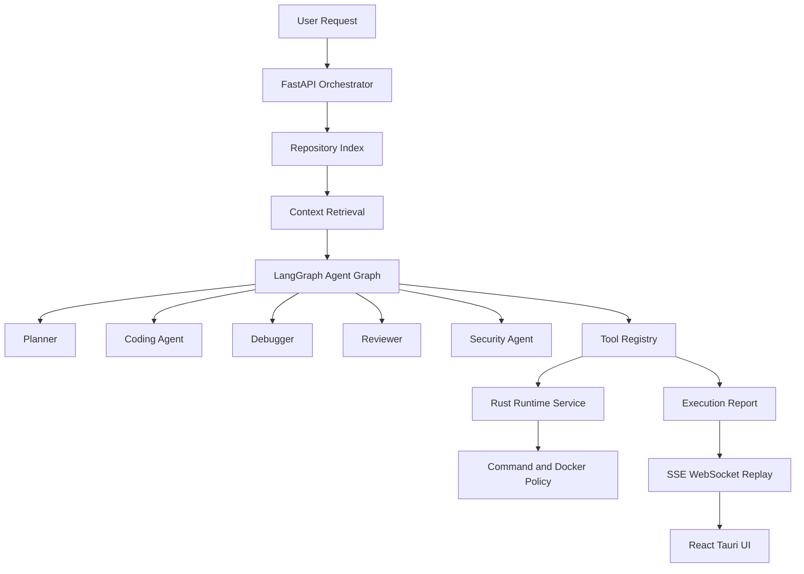

# Autonomous Coding Agent Platform

This document describes the production-ready Python + Rust autonomous coding-agent architecture in OctoBot.

## Current State

OctoBot now includes these platform surfaces:

- FastAPI orchestrator in `backend/octobot_orchestrator/main.py`
- Pydantic task, event, tool, and runtime contracts in `backend/octobot_orchestrator/contracts.py`
- LangGraph-compatible agent graph with deterministic fallback in `backend/octobot_orchestrator/agents/graph.py`
- Provider-backed agents for Ollama, OpenAI, Anthropic, and Groq-compatible APIs
- Async tool registry for filesystem, search, execution, validation, dependency, docs, Git, and runtime-routed tools
- Repository indexing with stable hashing, symbol/import/call extraction, dependency graph output, and optional tree-sitter parser hooks
- Persistent coding memory with SQLite, optional Chroma, deterministic embeddings, sentence-transformers support, dependency-aware retrieval, and context compression
- Rust runtime WebSocket service in `src/runtime_service.rs` with local execution, Docker execution, command policy, filesystem operations, stdout/stderr streaming, timeouts, and cancellation
- Autonomous execution loop with planning, tool execution, provider-edit patch generation, validation gates, Debugger Agent repair, replayable events, and execution reports
- SSE and WebSocket task streams, replay API, Prometheus-compatible metrics, trace export, and structured log export
- React + TypeScript + Vite frontend and Tauri desktop shell under `frontend/`
- Plugin SDK with manifest validation, permission scopes, signed manifest verification, lock records, scaffolding, tests, and examples
- Dockerfiles, Compose profiles, service-token auth, TLS reverse-proxy config, healthchecks, and production env template

## Architecture



## Run Locally

Install Python dependencies:

```bash
python -m venv .venv
. .venv/bin/activate
pip install -e ".[dev]"
```

Optional model, indexing, and RAG dependencies:

```bash
pip install -e ".[ai,indexing,rag]"
```

Start the orchestrator:

```bash
uvicorn backend.octobot_orchestrator.main:app --host 127.0.0.1 --port 8787
```

Start the Rust runtime service:

```bash
OCTOBOT_RUNTIME_ONLY=1 cargo run
```

Start the frontend:

```bash
cd frontend
npm ci
npm run dev
```

## APIs

| Endpoint | Purpose |
|---|---|
| `GET /health` | Orchestrator health |
| `POST /api/tasks` | Create a coding task |
| `POST /api/tasks/{task_id}/run` | Run a task |
| `GET /api/tasks/{task_id}/events` | SSE task stream |
| `WS /ws/tasks/{task_id}` | WebSocket task stream |
| `GET /api/tasks/{task_id}/events/replay` | Persistent task event replay |
| `GET /api/tasks/{task_id}/observability` | Task observability summary |
| `GET /metrics` | Prometheus-compatible metrics |
| `GET /api/observability/traces` | Trace export |
| `GET /api/observability/logs` | Structured log export |

## Runtime API

The runtime service listens on `OCTOBOT_RUNTIME_ADDR`, defaulting to `127.0.0.1:7879`.

```text
GET /runtime/health
WS  /runtime/tools/{tool}
```

Tool requests stream JSON events such as `tool.started`, `tool.output`, `tool.completed`, and `tool.failed`. Send a WebSocket text message containing `"cancel"` to terminate a running command.

## Production Checks

The current production baseline is verified with:

```bash
cargo check
cargo test
cargo clippy --all-targets -- -D warnings
PYTHONPATH=. .venv/bin/pytest
PYTHONPATH=. .venv/bin/ruff check backend tests
cd frontend && npm ci && npm run build && npm audit
cd frontend/src-tauri && cargo check
OCTOBOT_SERVICE_TOKEN=production-token \
OCTOBOT_TLS_CERT=/path/to/tls.crt \
OCTOBOT_TLS_KEY=/path/to/tls.key \
POSTGRES_PASSWORD=change-me \
docker compose --profile single-node config
```

## Production Requirements

Before deploying, provide:

- `OCTOBOT_SERVICE_TOKEN`
- `OCTOBOT_TLS_CERT`
- `OCTOBOT_TLS_KEY`
- `POSTGRES_PASSWORD`
- Real image build and push pipeline
- Environment-specific end-to-end tests against your infrastructure
